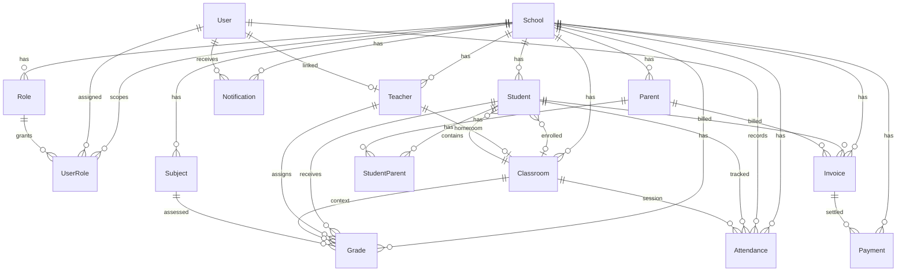

# Database Architecture — EduManager Pro

**Step 5: Multi-Tenant SaaS Foundation**  
**Engine:** PostgreSQL 15+ · Prisma ORM 6.x  
**Schema:** `database/prisma/schema.prisma`

---

## 1. Overview

EduManager Pro is a **multi-tenant SaaS** platform where:

- **One platform** serves thousands of schools
- **Each school** is an isolated tenant (`School` model)
- **Every business record** is scoped by `schoolId` (row-level tenancy)
- **Users** are global accounts; school access is granted via `UserRole`

```
┌─────────────────────────────────────────────────────────────┐
│                     EduManager Pro Platform                  │
│  ┌──────────┐  ┌──────────┐  ┌──────────┐  ┌──────────┐   │
│  │ School A │  │ School B │  │ School C │  │ School … │   │
│  │ tenant   │  │ tenant   │  │ tenant   │  │ tenant   │   │
│  └────┬─────┘  └────┬─────┘  └────┬─────┘  └────┬─────┘   │
│       │ schoolId    │ schoolId    │ schoolId    │           │
│       ▼             ▼             ▼             ▼           │
│   Students      Students      Students      Students        │
│   Teachers      Teachers      Teachers      Teachers        │
│   Invoices      Invoices      Invoices      Invoices        │
└─────────────────────────────────────────────────────────────┘
```

---

## 2. Entity-Relationship Diagram



---

## 3. Table Catalog

| Table | Model | Tenant-scoped | Soft delete | Purpose |
|-------|-------|---------------|-------------|---------|
| `schools` | School | Root tenant | ✅ | Platform tenant root |
| `users` | User | Global | ✅ | Authentication identity |
| `roles` | Role | Optional `school_id` | ✅ | RBAC role definitions |
| `user_roles` | UserRole | `school_id` required | ❌ | User ↔ Role ↔ School membership |
| `students` | Student | ✅ | ✅ | Enrolled learners |
| `parents` | Parent | ✅ | ✅ | Guardian contacts |
| `student_parents` | StudentParent | Via FK | ❌ | Student–parent linkage |
| `teachers` | Teacher | ✅ | ✅ | Teaching staff |
| `classrooms` | Classroom | ✅ | ✅ | Class groups / sections |
| `subjects` | Subject | ✅ | ✅ | Curriculum subjects |
| `grades` | Grade | ✅ | ✅ | Academic scores |
| `attendances` | Attendance | ✅ | ✅ | Daily attendance records |
| `invoices` | Invoice | ✅ | ✅ | Billing documents |
| `payments` | Payment | ✅ | ✅ | Payment transactions |
| `notifications` | Notification | ✅ | ✅ | In-app / multi-channel alerts |

**Total:** 15 business tables · 14 PostgreSQL enums · 60+ indexes

---

## 4. Table Relationships

### 4.1 Tenant root

```
School (1) ──► (N) Student, Parent, Teacher, Classroom, Subject,
               Grade, Attendance, Invoice, Payment, Notification, Role, UserRole
```

### 4.2 Identity & access

```
User (1) ──► (N) UserRole ◄── (N) Role
UserRole.schoolId ──► School (mandatory tenant context)

User (1) ──► (0..1) Teacher.userId   (staff account link)
User (1) ──► (N) Notification       (recipient)
User (1) ──► (N) Attendance.recordedById
```

### 4.3 Academic graph

```
Student (N) ──► (1) School
Student (N) ──► (0..1) Classroom
Student (N) ◄──► (N) Parent   via student_parents

Teacher (N) ──► (1) School
Teacher (1) ──► (0..1) Classroom   homeroom (1:1 via homeroom_teacher_id)

Grade: Student + Subject + School (+ optional Classroom, Teacher)
Attendance: Student + School + Date (+ optional Classroom)
```

### 4.4 Finance graph

```
Invoice ──► School (required)
Invoice ──► Student? | Parent?   (billing target)
Payment ──► Invoice + School     (denormalized schoolId for tenant queries)
```

### 4.5 Cardinality summary

| From | To | Cardinality | Junction |
|------|----|-------------|----------|
| School | All tenant entities | 1:N | — |
| User | School | N:M | `user_roles` |
| Student | Parent | N:M | `student_parents` |
| Student | Classroom | N:1 | direct FK |
| Teacher | Classroom | 1:1 | homeroom FK |
| Invoice | Payment | 1:N | — |

---

## 5. Multi-Tenant Strategy

### 5.1 Approach: Row-level isolation

| Principle | Implementation |
|-----------|----------------|
| Tenant key | `school_id` on every tenant-scoped table |
| Global entities | `User` only (email is platform-wide) |
| Access control | `UserRole` binds `user_id + role_id + school_id` |
| Query rule | **Every** tenant query MUST include `WHERE school_id = :tenantId` |
| Super admin | Platform roles with `roles.school_id IS NULL` |

### 5.2 Tenant boundary enforcement (planned API layer)

```typescript
// Prisma middleware pattern (future — not implemented in Step 5)
prisma.$use(async (params, next) => {
  if (TENANT_MODELS.includes(params.model)) {
    if (params.action === 'findMany' || params.action === 'findFirst') {
      params.args.where = { ...params.args.where, schoolId: ctx.schoolId };
    }
    if (params.action === 'create') {
      params.args.data = { ...params.args.data, schoolId: ctx.schoolId };
    }
  }
  return next(params);
});
```

### 5.3 Denormalized `schoolId`

`Payment.schoolId` is denormalized from `Invoice.schoolId` to:

- Enable direct tenant-scoped payment queries without joins
- Support composite indexes on `(school_id, status, paid_at)`
- Simplify row-level security policies

### 5.4 Cross-tenant invariants

| Rule | Enforcement |
|------|-------------|
| Student.classroomId must belong to same school | Application validation + FK chain |
| Grade.studentId must match Grade.schoolId | Application validation |
| UserRole.schoolId must match Role.schoolId (when role is school-scoped) | Application validation |
| Payment.schoolId must match Invoice.schoolId | Application validation |

### 5.5 Scalability path

| Scale | Strategy |
|-------|----------|
| 0–5K schools | Single PostgreSQL, row-level tenancy (current) |
| 5K–50K schools | Read replicas, connection pooling (PgBouncer), partition by `school_id` hash |
| Enterprise tier | Optional schema-per-tenant or dedicated DB per large district |

---

## 6. Index Strategy

### 6.1 Universal patterns

Every tenant table includes:

```sql
INDEX (school_id)
INDEX (school_id, deleted_at)        -- soft-delete filtered lists
INDEX (school_id, status)            -- where applicable
```

### 6.2 Unique constraints

| Table | Unique key | Scope |
|-------|-----------|-------|
| `schools` | `slug` | Platform |
| `users` | `email` | Platform |
| `roles` | `(school_id, slug)` | Per school |
| `user_roles` | `(user_id, role_id, school_id)` | Membership |
| `students` | `(school_id, student_number)` | Per school |
| `teachers` | `(school_id, employee_number)` | Per school |
| `classrooms` | `(school_id, name, academic_year)` | Per school |
| `subjects` | `(school_id, code)` | Per school |
| `grades` | `(school_id, student_id, subject_id, term, academic_year)` | Per school |
| `attendances` | `(school_id, student_id, date)` | Per school |
| `invoices` | `(school_id, invoice_number)` | Per school |

### 6.3 Query-optimized indexes

| Use case | Index |
|----------|-------|
| Student roster by class | `(school_id, classroom_id, status)` |
| Student name search | `(school_id, last_name, first_name)` |
| Attendance daily report | `(school_id, date)`, `(school_id, classroom_id, date)` |
| Attendance alerts | `(school_id, status, date)` |
| Grade report cards | `(school_id, student_id, academic_year)` |
| Invoice aging | `(school_id, status, due_date)` |
| Unread notifications | `(school_id, user_id, is_read)` |
| Payment reconciliation | `(school_id, paid_at)`, `(school_id, status)` |

### 6.4 Soft-delete partial unique indexes (Migration 0002)

Standard `@@unique` constraints block key reuse after soft delete. Migration `0002_soft_delete_partial_unique_indexes` replaces them with:

```sql
CREATE UNIQUE INDEX ... WHERE deleted_at IS NULL;
```

This allows re-issuing `student_number`, `invoice_number`, etc. after archival.

---

## 7. Cascading Strategy

| Relationship | onDelete | Rationale |
|--------------|----------|-----------|
| School → tenant entities | `Restrict` | Prevent accidental tenant wipe |
| School → Role, UserRole | `Cascade` | Cleanup access artifacts on hard delete |
| User → UserRole | `Cascade` | Remove memberships when user hard-deleted |
| Student/Parent → StudentParent | `Cascade` | Junction cleanup |
| Student → Grade, Attendance | `Restrict` | Protect academic records |
| Invoice → Payment | `Restrict` | Protect financial records |
| Optional FKs (classroom, teacher, user) | `SetNull` | Preserve records when reference removed |

**Production policy:** Prefer `deletedAt = now()` (soft delete) over hard delete for all business entities.

---

## 8. Soft Delete

| Field | Type | Usage |
|-------|------|-------|
| `deleted_at` | `TIMESTAMP(3) NULL` | `NULL` = active, set = archived |

**Applied to:** School, User, Role, Student, Parent, Teacher, Classroom, Subject, Grade, Attendance, Invoice, Payment, Notification

**Not applied to:** UserRole, StudentParent (junction tables — hard delete or cascade)

**Query convention:**

```sql
SELECT * FROM students
WHERE school_id = $1 AND deleted_at IS NULL;
```

---

## 9. Migration Report

### 9.1 Migrations

| # | Name | Status | Description |
|---|------|--------|-------------|
| `0001` | `init_multi_tenant_foundation` | Generated | 14 enums, 15 tables, 60+ indexes, all FKs |
| `0002` | `soft_delete_partial_unique_indexes` | Generated | Partial unique indexes for active records |

### 9.2 Objects created (Migration 0001)

- **Enums:** 14 (`school_status`, `school_plan`, `user_status`, …)
- **Tables:** 15
- **Foreign keys:** 28
- **Indexes:** 60+

### 9.3 Apply migrations

```bash
# Copy environment file
cp .env.example .env

# Ensure PostgreSQL is running with credentials from .env
pnpm db:migrate

# Or deploy in CI/production
pnpm db:migrate:deploy

# Regenerate client after schema changes
pnpm db:generate
```

### 9.4 Local verification

```bash
pnpm db:validate    # Schema syntax check
pnpm db:generate    # Prisma Client generation
pnpm db:studio      # Visual data browser
```

> **Note:** Migration apply requires a running PostgreSQL instance matching `DATABASE_URL` in `.env`. If credentials differ from `.env.example`, update `.env` before migrating.

---

## 10. Architecture Review

### 10.1 Strengths

| Area | Assessment |
|------|------------|
| **Tenant isolation** | `schoolId` on all business tables; denormalized on Payment |
| **RBAC foundation** | Flexible Role + UserRole with per-school scoping |
| **Data integrity** | FK constraints, unique business keys, Restrict on critical paths |
| **Audit readiness** | `created_at`, `updated_at` on all entities |
| **Operational safety** | Soft delete + partial unique indexes |
| **Query performance** | Composite indexes aligned to dashboard/report patterns |
| **Scalability** | Single-schema row tenancy scales to thousands of schools on PostgreSQL |

### 10.2 Design decisions

| Decision | Choice | Alternative considered |
|----------|--------|------------------------|
| Tenancy model | Row-level (`schoolId`) | Schema-per-tenant |
| User model | Global user, school via UserRole | Per-school user accounts |
| Role scope | Nullable `schoolId` for platform roles | Separate system_roles table |
| Classroom–Teacher | 1:1 homeroom via unique FK | Junction table (deferred) |
| Payment tenant key | Denormalized `schoolId` | Join through Invoice only |
| Grade uniqueness | Per term + academic year | Per assignment (more granular, future) |

### 10.3 Future extensions (out of Step 5 scope)

- `AcademicYear` model (currently `academic_year` string field)
- `Enrollment` junction (Student ↔ Classroom history)
- `Permission` table (currently `roles.permissions` JSON)
- `AuditLog` for compliance
- PostgreSQL Row-Level Security (RLS) policies
- Prisma tenant middleware in `apps/api`
- Read replicas and table partitioning

### 10.4 Production checklist

- [ ] Apply migrations: `pnpm db:migrate:deploy`
- [ ] Configure connection pooling (PgBouncer)
- [ ] Enable automated backups
- [ ] Implement Prisma tenant middleware
- [ ] Add RLS policies as defense-in-depth
- [ ] Monitor slow queries on `(school_id, …)` indexes
- [ ] Seed system roles (super_admin, school_admin, teacher, parent)

---

## 11. File Reference

```
database/
├── prisma/
│   ├── schema.prisma                          # Single source of truth
│   └── migrations/
│       ├── migration_lock.toml
│       ├── 0001_init_multi_tenant_foundation/
│       │   └── migration.sql
│       └── 0002_soft_delete_partial_unique_indexes/
│           └── migration.sql
├── migrations/                                # Reserved (legacy placeholder)
└── seed/                                      # Future seed scripts
```

---

## Related Documentation

- [ARCHITECTURE.md](./ARCHITECTURE.md) — System architecture
- [TECH_STACK.md](./TECH_STACK.md) — Technology choices
- [ROADMAP.md](./ROADMAP.md) — Phase 1.3 Database Foundation
